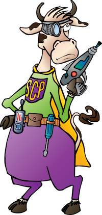

## Zeek Analysis Tools (ZAT)     

The ZAT Python package supports the processing and analysis of Zeek data
with Pandas, scikit-learn, and Spark

### Recent Improvements (Fall 2019):
- Renamed to **Zeek** Analysis Tools \:)
- Better Docs (<https://supercowpowers.github.io/zat/>)
- Faster/Smaller Pandas Dataframes for large log files: [Large Dataframes](https://supercowpowers.github.io/zat/large_dataframes.html)
- Better Panda Dataframe to Matrix (ndarray) support: [Dataframe To Matrix](https://supercowpowers.github.io/zat/dataframe_to_matrix.html)
- Scalable conversion from Zeek logs to Parquet: [Zeek to Parquet](https://nbviewer.jupyter.org/github/SuperCowPowers/zat/blob/master/notebooks/Zeek_to_Parquet.ipynb)
- Vastly improved Spark Dataframe Class: [Zeek to Spark](https://nbviewer.jupyter.org/github/SuperCowPowers/zat/blob/master/notebooks/Zeek_to_Spark.ipynb)
- Updated/improved Notebooks: [Analysis Notebooks](#analysis-notebooks)

### BroCon 2017 Presentation

Data Analysis, Machine Learning, Bro, and You!
([Video](https://www.youtube.com/watch?v=pG5lU9CLnIU))

### Why ZAT?

Zeek already has a flexible, powerful scripting language why should I use
ZAT?

**Offloading:** Running complex tasks like statistics, state machines,
machine learning, etc.. should be offloaded from Zeek so that Zeek can
focus on the efficient processing of high volume network traffic.

**Data Analysis:** We have a large set of support classes that help
bridge from raw Zeek data to packages like Pandas, scikit-learn, and
Spark. We also have example notebooks that show step-by-step how to get
from here to there.

## Getting Started
- [Examples of Using ZAT](https://supercowpowers.github.io/zat/examples.html)

### Analysis Notebooks

- [Zeek to Scikit-Learn](https://nbviewer.jupyter.org/github/SuperCowPowers/zat/blob/master/notebooks/Zeek_to_Scikit_Learn.ipynb)
- [Zeek to Parquet](https://nbviewer.jupyter.org/github/SuperCowPowers/zat/blob/master/notebooks/Zeek_to_Parquet.ipynb)
- [Zeek to Spark](https://nbviewer.jupyter.org/github/SuperCowPowers/zat/blob/master/notebooks/Zeek_to_Spark.ipynb)
- [Spark Clustering](https://nbviewer.jupyter.org/github/SuperCowPowers/zat/blob/master/notebooks/Spark_Clustering.ipynb)
- [Zeek to Kafka](https://nbviewer.jupyter.org/github/SuperCowPowers/zat/blob/master/notebooks/Zeek_to_Kafka.ipynb)
- [Zeek to Kafka to Spark](https://nbviewer.jupyter.org/github/SuperCowPowers/zat/blob/master/notebooks/Zeek_to_Kafka_to_Spark.ipynb)
- [Clustering: Picking K (or not)](https://nbviewer.jupyter.org/github/SuperCowPowers/zat/blob/master/notebooks/Clustering_Picking_K.ipynb)
- [Anomaly Detection Exploration](https://nbviewer.jupyter.org/github/SuperCowPowers/zat/blob/master/notebooks/Anomaly_Detection.ipynb)
- [Risky Domains Stats and Deployment](https://nbviewer.jupyter.org/github/SuperCowPowers/zat/blob/master/notebooks/Risky_Domains.ipynb)
- [Zeek to Matplotlib](https://nbviewer.jupyter.org/github/SuperCowPowers/zat/blob/master/notebooks/Zeek_to_Plot.ipynb)

### Install

    $ pip install zat

### Documentation
<https://supercowpowers.github.io/zat/>

### About SuperCowPowers
The company was formed so that its developers could follow their passion for Python, streaming data pipelines and having fun with data analysis. We also think cows are cool and should be superheros or at least carry around rayguns and burner phones. <a href="https://www.supercowpowers.com" target="_blank">Visit SuperCowPowers</a>

